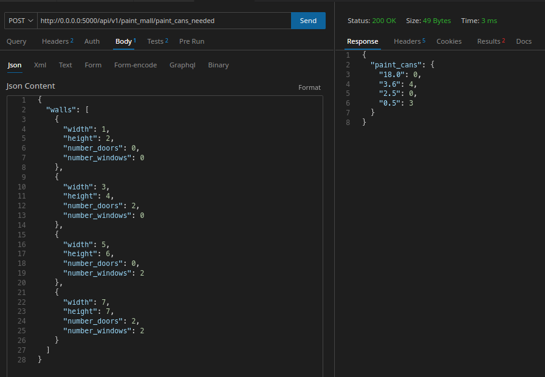
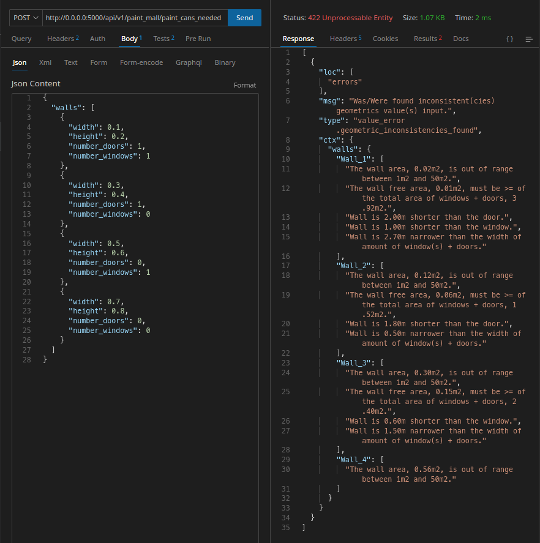
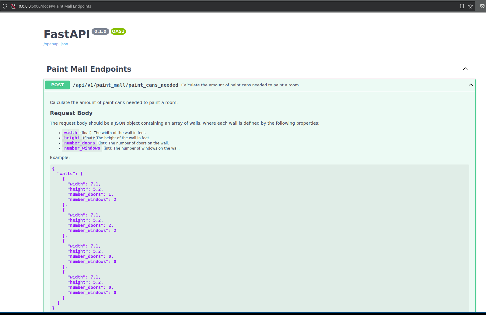

# <Paint-Mall-Service>

## About
```text
    This is a web API application that helps users calculate the amount of paint
  needed to paint a room.
    The app takes into account the size of the room, the number of walls,
  doors, and windows in each wall, and recommends the sizes of paint cans
  the user should buy.
    The program also alerts users to inconsistencies or non-standard measurements.
```
---
## Table of Contents

>[Motivation](#motivation)

>[Usage](#usage)

>[Requirements](#requirements)

>[Running instructions](#running-instructions)

>[Test Coverage](#test-coverage)

>[Safety Report](#safety-report)


---
## Motivation

* **Motivation:**
    My motivation for building the project may have been a desire to create
  a tool that simplifies the processof calculating the required amount of
  paint for a room, making it more accessible to people who may not have
  experience in painting.

* **Why did you build this project**:
    Study purpose

* **Problem-solving:**
    The project solves the problem of accurately determining the amount of
  paint needed for a room, taking into account factors such as wall size,
  the number of doors and windows, and paint can sizes.

* **Learning:**
    I have learned about the process of building a web application using
  Python and the FastAPI framework, as well as the nuances of implementing
  a paint calculator algorithm. Additionally, they may  have gained experience
  software design and archtecture and user experience considerations.
---
## Usage
```text
  To use this application, the user simply needs to input the dimensions
of each wall and the number of windows and doors on each wall. The system
will then calculate the amount of paint needed for each color and suggest
the appropriate paint can sizes to buy.

  The user can also choose to enter custom paint can sizes or select from
a list of commonly available paint can sizes.

  The application is intended to be user-friendly and straightforward,
allowing even those with no prior experience in painting to accurately
calculate the required amount of paint for their room.
```

* **An example of a successful response when sending  data  correct measurements of a room**



* **An example of an unsuccessful response when sending incorrect or inconsistent measurement data from a room**



* **You can also access via browser and have a more friendly interaction via Swagger.**




---
>[Back to Table of Contents](#table-of-contents)

## Requirements
* **[Python](https://www.python.org/)**
* **[FastAPI](https://fastapi.tiangolo.com/)**


---
## Running instructions
Run the follow cli in root folder, ./app
```console
docker-compose build
docker-compose up
```
---

---
## Repository overview
```text

├── app
│   ├── Dockerfile
│   ├── Makefile
│   ├── Pipfile
│   ├── Pipfile.lock
│   ├── pyproject.toml
│   ├── README.md
│   ├── requirements_dev.txt
│   ├── requirements.txt
│   ├── run.py
│   ├── src
│   │   ├── api
│   │   │   ├── factory.py
│   │   │   └── resources
│   │   │       ├── paint_cans_calculator
│   │   │       │   ├── room_analyzer_paint_cans.py
│   │   │       │   └── router.py
│   │   ├── controllers
│   │   │   ├── main_controller.py
│   │   │   ├── paint_cans_needed_coordinator.py
│   │   ├── schemas
│   │   │   ├── base_schema_geometric.py
│   │   │   ├── door.py
│   │   │   ├── exception.py
│   │   │   ├── request
│   │   │   │   ├── exception.py
│   │   │   │   └── room.py
│   │   │   ├── response
│   │   │   │   ├── exception.py
│   │   │   │   ├── paint_cans_needed.py
│   │   │   │   └── unprocessable_geometric_object.py
│   │   │   ├── wall.py
│   │   │   └── window.py
│   │   └── services
│   │       ├── exception.py
│   │       ├── interfaces
│   │       │   ├── geometric_validator_interface.py
│   │       │   ├── paint_cans_interface.py
│   │       ├── paint_cans_needed_calculator.py
│   │       └── room_validator.py
│   ├── tests
│   │   ├── conftest.py
│   │   ├── e2e
│   │   │   ├── api
│   │   │   │   └── test_paint_cans_calculator.py
│   │   ├── integration
│   │   │   ├── controllers
│   │   │   │   ├── test_main_controller.py
│   │   │   │   └── test_paint_cans_needed_coordinator.py
│   │   └── unit
│   │       ├── api
│   │       │   └── test_factory_api.py
│   │       ├── schemas
│   │       │   ├── request
│   │       │   │   └── test_room.py
│   │       │   ├── response
│   │       │   │   ├── test_exception.py
│   │       │   │   ├── test_paint_cans_needed.py
│   │       │   │   └── test_unprocessable_geometric_object.py
│   │       │   ├── test_base_schema_geometric.py
│   │       │   ├── test_door.py
│   │       │   ├── test_wall.py
│   │       │   └── test_window.py
│   │       └── services
│   │           ├── interface
│   │           │   ├── test_geometric_validator_interface.py
│   │           │   └── test_paint_cans_interface.py
│   │           ├── test_paint_cans_needed_calculator.py
│   │           └── test_room_validator.py
├── docker-compose.yaml
├── Pipfile
└── README.md
```
>[Back to Table of Contents](#table-of-contents)
---
## Test Coverage

```text
Name                                                                  Stmts   Miss  Cover
-----------------------------------------------------------------------------------------
src/__init__.py                                                           0      0   100%
src/api/__init__.py                                                       1      0   100%
src/api/factory.py                                                        6      0   100%
src/api/resources/__init__.py                                             0      0   100%
src/api/resources/paint_cans_calculator/__init__.py                       0      0   100%
src/api/resources/paint_cans_calculator/room_analyzer_paint_cans.py      17      2    88%
src/api/resources/paint_cans_calculator/router.py                         4      0   100%
src/controllers/main_controller.py                                       33      3    91%
src/controllers/paint_cans_needed_coordinator.py                         34      2    94%
src/schemas/__init__.py                                                   0      0   100%
src/schemas/base_schema_geometric.py                                     18      0   100%
src/schemas/door.py                                                       6      0   100%
src/schemas/exception.py                                                  6      0   100%
src/schemas/request/__init__.py                                           0      0   100%
src/schemas/request/exception.py                                          6      0   100%
src/schemas/request/room.py                                              29      3    90%
src/schemas/response/__init__.py                                          0      0   100%
src/schemas/response/exception.py                                         4      0   100%
src/schemas/response/paint_cans_needed.py                                16      0   100%
src/schemas/response/unprocessable_geometric_object.py                   15      0   100%
src/schemas/wall.py                                                      38      3    92%
src/schemas/window.py                                                     6      0   100%
src/services/__init__.py                                                  0      0   100%
src/services/exception.py                                                13      0   100%
src/services/interfaces/geometric_validator_interface.py                 14      3    79%
src/services/interfaces/paint_cans_interface.py                          14      3    79%
src/services/paint_cans_needed_calculator.py                             36      6    83%
src/services/room_validator.py                                          112     16    86%
tests/__init__.py                                                         0      0   100%
tests/conftest.py                                                        89      1    99%
tests/e2e/api/test_paint_cans_calculator.py                              16      0   100%
tests/integration/__init__.py                                             0      0   100%
tests/integration/controllers/__init__.py                                 0      0   100%
tests/integration/controllers/test_main_controller.py                    21      0   100%
tests/integration/controllers/test_paint_cans_needed_coordinator.py      17      0   100%
tests/unit/__init__.py                                                    0      0   100%
tests/unit/api/__init__.py                                                0      0   100%
tests/unit/api/test_factory_api.py                                       12      0   100%
tests/unit/schemas/__init__.py                                            0      0   100%
tests/unit/schemas/request/__init__.py                                    0      0   100%
tests/unit/schemas/request/test_room.py                                  15      0   100%
tests/unit/schemas/response/__init__.py                                   0      0   100%
tests/unit/schemas/response/test_exception.py                             9      0   100%
tests/unit/schemas/response/test_paint_cans_needed.py                    10      0   100%
tests/unit/schemas/response/test_unprocessable_geometric_object.py        7      0   100%
tests/unit/schemas/test_base_schema_geometric.py                         14      0   100%
tests/unit/schemas/test_door.py                                          20      0   100%
tests/unit/schemas/test_wall.py                                          36      0   100%
tests/unit/schemas/test_window.py                                        20      0   100%
tests/unit/services/__init__.py                                           0      0   100%
tests/unit/services/interface/__init__.py                                 0      0   100%
tests/unit/services/interface/test_geometric_validator_interface.py      20      1    95%
tests/unit/services/interface/test_paint_cans_interface.py               20      1    95%
tests/unit/services/test_paint_cans_needed_calculator.py                 19      0   100%
tests/unit/services/test_room_validator.py                               86      0   100%
-----------------------------------------------------------------------------------------
TOTAL                                                                   859     44    95%
```

>[Back to Table of Contents](#table-of-contents)


## Safety Report

```text
 REPORT

  Safety v2.3.2 is scanning for Vulnerabilities...
  Scanning dependencies in your files:

  -> /tmp/app-IVRHTicNim9o8hc__requirements.txt

  Found and scanned 56 packages
  Timestamp 2023-03-29 03:01:36
  0 vulnerabilities found
  0 vulnerabilities ignored
+=========================================================================================+

 No known security vulnerabilities found.

+=========================================================================================+
```
---

## License
```text
This project is licensed under the terms of the MIT license.
```
